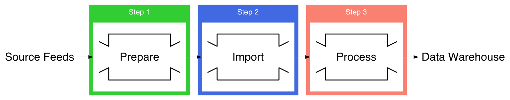

---

# @size[0.6em](Robust Data Processing Pipeline with Elixir and Flow)
## @size[0.6em](László Bácsi, 100Starlings)
### @size[0.6em](@fa[github]lackac @fa[twitter]@icanscale)

---

# Disclaimer

* first Elixir talk
* talk is based on uncompleted work
* based on client work<sup>*</sup>
* pipeline target is AWS Redshift

@css[small](<sup>*</sup> CollectPlus: parcel service in the UK)

---

## What does the machine do?


---

## Approaching a data project


+++

### Going Outside In


+++

### ETL, ELT, potayto, potahto



---

## Let It Flow


+++

## Glimpse of a Flow

``` elixir
def flow(input) do
  input
  |> Flow.from_enumerable(opts)
  |> Flow.filter(&feed_file?/1)
  |> Flow.map(&get_feed/1)
  |> Flow.map(&prepare_feed/1)
  |> Flow.map(&upload_feeds/1)
  |> Flow.partition(stages: 1, window: opts[:window])
  |> Flow.reduce(fn -> [] end, fn feed, acc -> [feed | acc] end)
  |> Flow.emit(:state)
end
```

@[2-3](Initialize the Flow from an enumerable)
@[4-7](Mapping stages prepare and upload the files in parallel)
@[8-9](Reduce feeds over a window into lists)

+++?image=assets/images/tubes.jpg&opacity=40

## It's a Series of Tubes

+++

## Pipes, pipes, and more pipes

``` elixir
def split_feed({key, contents}) do
  feed_id = Path.basename(key, ".csv")

  contents
  |> String.splitter("\n")
  |> Stream.with_index()
  |> Stream.map(fn {line, i} ->
    Enum.join([String.trim(line), feed_id, i + 1], ",")
  end)
  |> Enum.reduce({"", ""}, fn
    @advice_row <> row, {advices, events} ->
      {advices <> row <> "\n", events}
    @event_row  <> row, {advices, events} ->
      {advices, events <> row <> "\n"}
    _, acc -> acc
  end)
end
```

@[4-5](Start with the full contents of the feeds and create a stream of lines)
@[6-9](Add feed_id and row number to each row)
@[10-16](Separate advices and events)

---?image=assets/images/paul-morris-282853-unsplash.jpg&opacity=60

# Flow Crash Course

@css[credit](Photo by <a href="https://unsplash.com/photos/lcyF8BHpJBM">paul morris</a> on <a href="https://unsplash.com/search/photos/flowing">Unsplash</a>)

+++

## Researching Elixir Flow


+++

## So what _is_ Elixir Flow?

> Flow allows developers to express computations on collections, similar to the Enum and Stream modules, although computations will be executed in parallel using multiple GenStages.

+++

### Counting words  @size[0.6em](– the canonical example)

``` elixir
File.stream!("path/to/some/file")
|> Enum.flat_map(&String.split(&1, " "))
|> Enum.reduce(%{}, fn word, acc ->
  Map.update(acc, word, 1, & &1 + 1)
end)
|> Enum.to_list()
```

+++

### The same with `Stream`

``` elixir
File.stream!("path/to/some/file")
|> Stream.flat_map(&String.split(&1, " "))
|> Enum.reduce(%{}, fn word, acc ->
  Map.update(acc, word, 1, & &1 + 1)
end)
|> Enum.to_list()
```

+++

### And now with Flow

``` elixir
File.stream!("path/to/some/file")
|> Flow.from_enumerable()
|> Flow.flat_map(&String.split(&1, " "))
|> Flow.partition()
|> Flow.reduce(fn -> %{} end, fn word, acc ->
  Map.update(acc, word, 1, & &1 + 1)
end)
|> Enum.to_list()
```

+++

# Read the [docs](https://hexdocs.pm/flow/Flow.html)
### excellent as usual

---
