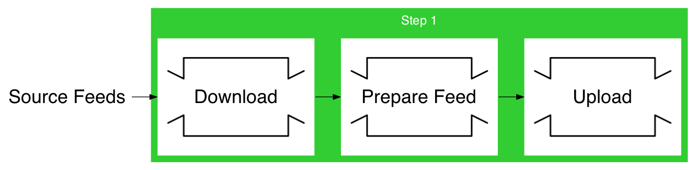

---

# @size[0.6em](Robust Data Processing Pipeline with Elixir and Flow)
## @size[0.6em](László Bácsi, 100Starlings)
### @size[0.6em](@fa[github]lackac @fa[twitter]@icanscale)
### [bit.ly/ex18-flow](http://bit.ly/ex18-flow)

---

# Disclaimer

* first Elixir talk
* talk is based on uncompleted work
* based on client work<sup>*</sup>
* pipeline target is AWS Redshift
* all pipelines are custom

<br>
@css[small](<sup>*</sup> CollectPlus: parcel service in the UK)

---

# Agenda

- Mental Model of a Pipeline   |
- Elixir Flow                  |
- Maintainability              |
- Failure Tolerance            |
- Scheduling                   |

---

## What does the machine do?


---?image=assets/images/scott-webb-383381-unsplash.jpg&position=center right&size=auto 100%&color=black

@title[Mental Model of a Pipeline]

# Mental
# Model
# of a
# Pipeline

@css[credit](Photo by <a href="https://unsplash.com/photos/tYa2Myli6qE">Scott Webb</a> on <a href="https://unsplash.com/">Unsplash</a>)

---

## Approaching a data project


+++

### Going Outside In


+++

### ETL, ELT, potayto, potahto


---

## Let It Flow



+++

## Glimpse of a Flow

``` elixir
def flow(input) do
  input
  |> Flow.from_enumerable(opts)
  |> Flow.filter(&feed_file?/1)
  |> Flow.map(&get_feed/1)
  |> Flow.map(&prepare_feed/1)
  |> Flow.map(&upload_feeds/1)
  |> Flow.partition(stages: 1, window: opts[:window])
  |> Flow.reduce(fn -> [] end, fn feed, acc -> [feed | acc] end)
  |> Flow.emit(:state)
end
```

@[4-7](Flow helps you express high level transformations as a pipeline…)
@[8-9](with mapping and reducing stages)

+++?image=assets/images/tubes.jpg&opacity=40

## It's a Series of Tubes

+++

## Pipes, pipes, and more pipes

``` elixir
def prepare_feed({key, contents}) do
  feed_id = Path.basename(key, ".csv")

  contents
  |> String.splitter("\n")
  |> Stream.with_index()
  |> Stream.map(fn {line, i} ->
    Enum.join([String.trim(line), feed_id, i + 1], ",")
  end)
  |> Enum.reduce(%Feed{}, &collect_feed_rows/2)
end
```

@[4-10](We are expressing the transformation as a pipeline again)

---?image=assets/images/paul-morris-282853-unsplash.jpg&opacity=60

# Flow Crash Course

<br>
@css[credit](Photo by <a href="https://unsplash.com/photos/lcyF8BHpJBM">paul morris</a> on <a href="https://unsplash.com/">Unsplash</a>)

+++

## Researching Elixir Flow


+++

## So what _is_ Elixir Flow?

> Flow allows developers to express computations on collections, similar to the Enum and Stream modules, although computations will be executed in parallel using multiple GenStages.

+++

### Counting words  @size[0.6em](– the canonical example)

``` elixir
File.stream!("path/to/some/file")
|> Enum.flat_map(&String.split(&1, " "))
|> Enum.reduce(%{}, fn word, acc ->
  Map.update(acc, word, 1, & &1 + 1)
end)
|> Enum.to_list()
```

+++

### The same with `Stream`

``` elixir
File.stream!("path/to/some/file")
|> Stream.flat_map(&String.split(&1, " "))
|> Enum.reduce(%{}, fn word, acc ->
  Map.update(acc, word, 1, & &1 + 1)
end)
|> Enum.to_list()
```

+++

### And now with Flow

``` elixir
File.stream!("path/to/some/file")
|> Flow.from_enumerable()
|> Flow.flat_map(&String.split(&1, " "))
|> Flow.partition()
|> Flow.reduce(fn -> %{} end, fn word, acc ->
  Map.update(acc, word, 1, & &1 + 1)
end)
|> Enum.to_list()
```

+++

# Read the [docs](https://hexdocs.pm/flow/Flow.html)
### excellent as usual

---?image=assets/images/kelvyn-ornettte-sol-marte-328832-unsplash.jpg&opacity=40

# Maintainability

- Composition     |
- Branching flows |

---

# Composition

* Two modes of operation
  * Historical
    * prepare, import, and process all data from 2012 to 2015
    * reimport and reprocess everything for year 2016
  * Real-time
    * monitor source for new files
    * run incoming data through the whole pipeline

+++

## Composable flows

``` elixir
defmodule ImportFeeds do
  @spec flow(Enumerable.t()) :: Flow.t()
  def flow(%Flow{} = flow) do
    flow
    |> Flow.map(&ensure_loaded/1)
    # |> ...
    |> Flow.emit(:state)
  end

  def flow(input) do
    input |> Flow.from_enumerable() |> flow()
  end
end
```

@[1-2](Each stage is implemented in a module with a `flow/1` function that takes an Enumerable and returns a Flow)
@[3-8](The actual implementation of the flow starts from a `Flow` struct)
@[10-12](Any other kind of input is expected to be an Enumerable, turned into a Flow and piped into `flow/1`)

+++

### Now this works

``` elixir
feeds
|> PrepareFeeds.flow()
|> ImportFeeds.flow()
|> Flow.run()
```

+++

### As does this

``` elixir
batch_ids
|> ImportFeeds.flow()
|> PorcessEvents.flow()
|> Flow.run()
```

+++

### We may also extend this to support different kind of sources

``` elixir
def flow(stage) when is_pid(stage) do
  stage |> Flow.from_stage() |> flow()
end
```

---

# Branching


+++

### Multiple cases and strategies

* keep it inside the Flow for simple cases especially if you need to join the data together again later
* use `Flow.into_stages/3` for complex situations

+++

### Branching example

``` elixir
flow
|> Flow.flat_map(&[{&1, :type_a}, {&1, :type_b}])
|> Flow.partition(stages: 2, max_demand: 1,
  hash: fn
    {_, :type_a} = event -> {event, 0}
    {_, :type_b} = event -> {event, 1}
  end
)
|> Flow.map(&import_type/1)
|> Flow.map(&mark_imported/1)
|> Flow.partition(stages: 1, window: window)
|> Flow.group_by(&elem(&1, 0).id, &elem(&1, 1))
  fn {%{batch_id: batch_id}, _} -> batch_id end,
  fn {_, feed_type} -> feed_type end
)
|> Flow.emit(:state)
|> Flow.flat_map(&Map.keys/1)
```

@[2](Annotate items with their branch identifier)
@[3-8](Partition items based on branch identifier)
@[9-11](These map stages happen in branched partitions)
@[12-18](Join data back together based on the first element in the tuple—the original items)

---

# Failure Tolerance


---

# Two sides

## Error handling
## Supervision

---

# Supervising Elixir Flows

``` elixir
FeedStorage.list_feeds(opts)
|> SplitFeeds.flow(window: window)
|> Flow.start_link()
```

@[3](Starts and runs the flow as a separate process)

+++

## Adding a flow to a supervision tree

``` elixir
def start_prepare_flow(opts) do
  {window, opts} = Keyword.pop(opts, :window)
  FeedStorage.list_feeds(opts)
  |> SplitFeeds.flow(window: window)
  |> start_flow_supervised()
end
```

@[5](We want to be able to do something like this)

+++

### Create a `DynamicSupervisor`

``` elixir
# in your supervisor
children = [
  # ...,
  {DynamicSupervisor, name: FlowSupervisor, strategy: :one_for_one}
]
```

+++

### Start an arbitrary flow supervised

``` elixir
defp start_flow_supervised(flow) do
  child_spec = %{
    id: make_ref(),
    start: {Flow, :start_link, [flow]},
    restart: :temporary,
    type: :supervisor
  }

  DynamicSupervisor.start_child(FlowSupervisor, child_spec)
end
```

@[2-7](Child Spec for the Flow supervisor)
@[4](We call `Flow.start_link/1` with `flow`)
@[9](Add the flow to our `FlowSupervisor`)

---?image=assets/images/daniel-tausis-563581-unsplash.jpg&opacity=40

# Error handling strategies

* Let it crash    |
* Flag and filter |
* Branch          |

<br>
@css[credit](Photo by <a href="https://unsplash.com/photos/loeqHoa1uWY">Daniel Tausis</a> on <a href="https://unsplash.com/">Unsplash</a>)

---

# Let it crash

Works well if you have an idempotent pipeline you can just restart, or if the occasional crash has a very low impact.

---

# Flag and Filter

``` elixir
flow
|> Flow.map(&get_feed/1)
|> Flow.map(&prepare_feed/1)
|> Flow.map(&upload_feeds/1)
|> Flow.filter(&filter_and_log/1)

def prepare_feed({:ok, feed}), do: do_prepare_feed(feed)
def prepare_feed({:error, _} = error), do: error

def filter_and_log({:ok, _}), do: true
def filter_and_log({:error, err}) do: log(err) && false
```

@[2-4](Each of these steps may return either `{:ok, value}` or `{:error, reason}`)
@[7-8](Their implementation ignores errors and passes them on)
@[5](At certain stages in the pipeline we log these errors and filter them out)
@[10-11](Success values are kept, errors are logged and rejected)

+++

# Benefits

* minimal impact on the pipeline structure
* failure handling checkpoints make it easier to see what's going on
* recommended to put checkpoint just before reduce step so that it deals with clean data

---

# Branching errors

* A combination of "Flag and Filter" and the "Branching flows" approach
* Branch `{:ok, value}` and `{:error, error}` into two partitions
* Only advised for complex error handling situations and when the number of errors is in the same ballpark as the success values

---

# Scheduling

* Simple scheduling is easy to achieve based on our composing functions (e.g. `start_prepare_flow/1` from earlier)
* for real-time processing we need something more
* looking to use RabbitMQ there

+++

# Scheduling flows with RabbitMQ


+++

## Still TBD

* The RabbitMQ consumer would be a GenStage producer for the flow
* And the RabbitMQ producer could be a GenStage consumer of the same flow
* This is still just on the drawing board
* Just the other day found [pma/wabbit](https://github.com/pma/wabbit/tree/master/lib/wabbit) on GitHub that looks interesting we might be able to use

---

# Summary

* Elixir with Flow is more than just parallel processing
* Break up a complex flow into composable steps
* Handle errors at the right place and supervise flows
* Combine flows with RabbitMQ for scheduling

---

### Thank you! Further reading

- [Flow Documentation](https://hexdocs.pm/flow/Flow.html)
- [Architecting Flow in Elixir Programs](http://trivelop.de/2018/03/26/flow-elixir-using-plug-like-token/) – Dr. René Föhring's excellent article series
- [These slides](https://gitpitch.com/lackac/elixirconf-eu-2018-robust-flow)
